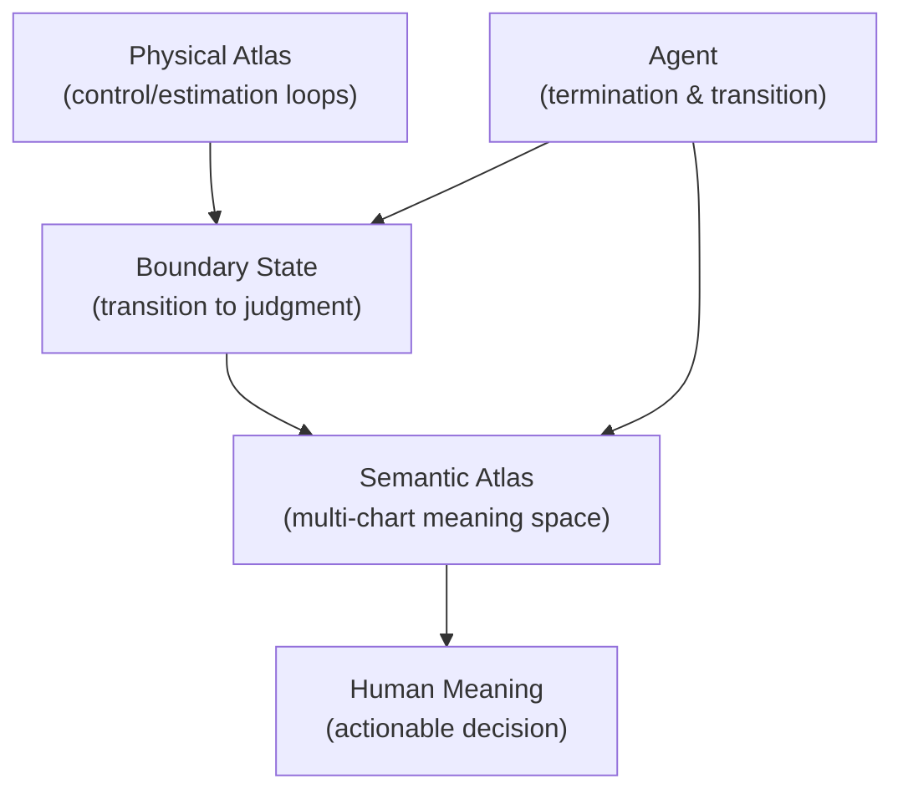
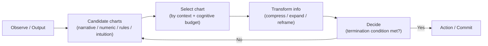

# Diagrams (Semantic Atlas Hypothesis)

These diagrams are intentionally simple and meant to support discussion, not to “prove” the hypothesis.

---

## 1) Physical Atlas → Boundary State → Semantic Atlas

**Reading**: Most physical states should remain in control space. Only *boundary states* should be escalated into semantic space, where chart selection and judgment termination become the design focus.

---

## 2) Chart selection loop (minimal)

**Reading**: The core failure mode is not “lack of information”, but missing chart selection + termination conditions, which causes semantic entropy to grow and decisions to be deferred.

